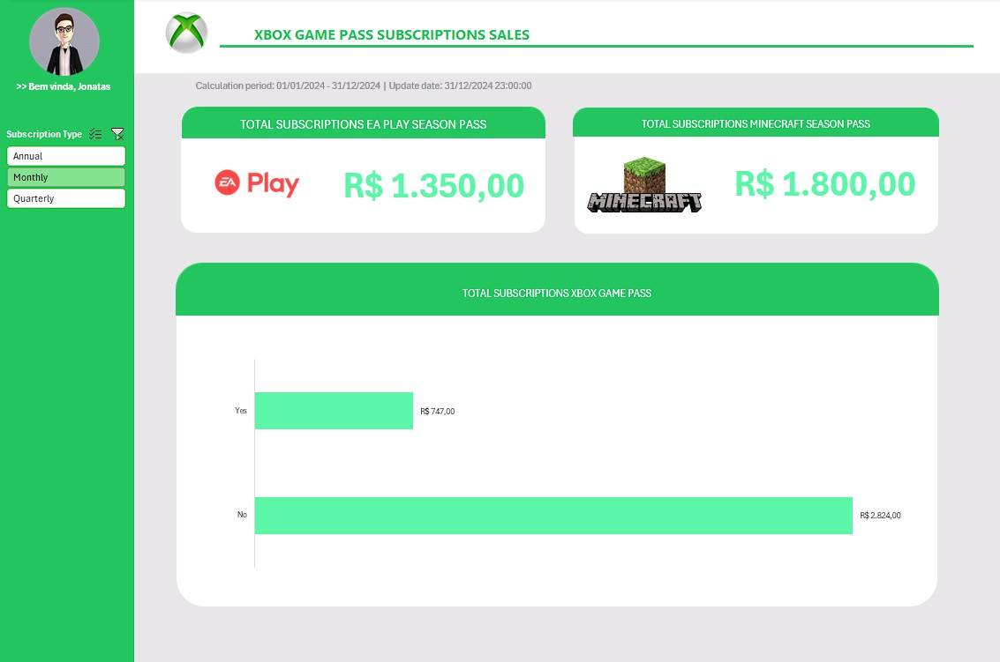

# 🎮 Dashboard Analítico de Vendas de Jogos Xbox

Este projeto apresenta um **dashboard interativo de vendas de jogos do Xbox**, desenvolvido no **Microsoft Excel**, com o objetivo de aplicar a metodologia **ABDCD** na criação de uma solução visual clara, analítica e voltada à tomada de decisão.  

A proposta foi transformar uma base de dados tratada em **insights estratégicos**, utilizando recursos visuais e interativos que evidenciam o desempenho comercial de produtos e períodos de venda.

---

## 🧩 Metodologia ABDCD

A construção do dashboard foi guiada pela metodologia **ABDCD**, que organiza o processo em etapas lógicas e progressivas:

| Etapa | Descrição |
|-------|------------|
| **A - Assets** | Definição da **identidade visual**, com cores, ícones e elementos gráficos inspirados na estética da marca Xbox. |
| **B - Base de Dados** | Utilização de uma **base de vendas pré-processada**, assegurando integridade e consistência dos dados. |
| **C - Cálculos** | Desenvolvimento de **tabelas dinâmicas e medidas analíticas** para responder às perguntas de negócio. |
| **D - Dashboard** | Construção do **painel visual interativo**, com filtros, segmentações e indicadores de desempenho. |

---

## 🎯 Questões de Negócio Investigadas

1. Qual é o **total de vendas** dos principais produtos, como **EA Play Season Pass** e **Minecraft Season Pass**?  
2. Como as **vendas evoluem ao longo do tempo** (ano, mês e trimestre)?  
3. Quais são os **períodos de maior volume de vendas** e quais fatores podem influenciá-los?  

Essas análises foram realizadas por meio de **gráficos, segmentações e tabelas dinâmicas**, permitindo uma visão clara e interativa do desempenho comercial.

---

## ⚙️ Funcionalidades do Dashboard

- Exibição do **total de vendas por produto e período**;  
- **Filtros dinâmicos** para análise temporal e comparativa;  
- Indicadores visuais que facilitam a **interpretação dos resultados**;  
- Design alinhado à **identidade visual da marca Xbox**, garantindo uma experiência estética coerente.  

---

## 🧠 Principais Insights Obtidos

- Identificação dos **produtos mais rentáveis** da plataforma;  
- Análise da **sazonalidade nas vendas**, destacando períodos de alta performance;  
- Reconhecimento de **tendências e padrões de comportamento de consumo**.  

Esses insights possibilitam uma visão estratégica sobre o desempenho de vendas e apoiam decisões baseadas em dados.

---

## 🖼️ Prévia do Dashboard

> 

---

## 🛠️ Ferramentas e Técnicas Utilizadas

- **Microsoft Excel** – Criação de tabelas dinâmicas, segmentações, fórmulas e formatação condicional;  
- **Design de Dashboard** – Aplicação de princípios visuais e metodológicos para clareza e coerência da informação.  

---

## 🧾 Passos para Exploração do Projeto

1. Baixe o arquivo **`Dashboard_Xbox.xlsx`**;  
2. Abra-o no **Microsoft Excel**;  
3. Acesse a aba **Dashboard** e utilize os **filtros interativos** para explorar os dados;  
4. Caso queira visualizar outras etapas (**Assets**, **Cálculos** e **Base de Dados**), siga o menu:  
   > `Exibir > Reexibir > Escolher Planilha`  

---

## 💡 Considerações Finais

O projeto reforça a importância do uso de **ferramentas acessíveis como o Excel** para gerar **análises de impacto** e **visualizações eficientes**.  
Com ele, foi possível demonstrar como a **organização metodológica (ABDCD)** e o **design orientado a dados** podem transformar informações brutas em **insights acionáveis e visualmente atraentes**.

---

## 👨‍💻 Autor

Desenvolvido por **Jonatas de Siqueira Bitencourt Cursino**  
📚 Estudante de **Ciência de Dados – UNINTER (2024–2026)**  
🌐 [LinkedIn - Jonatas ](https://www.linkedin.com/in/jonatas23siqueira/) 
